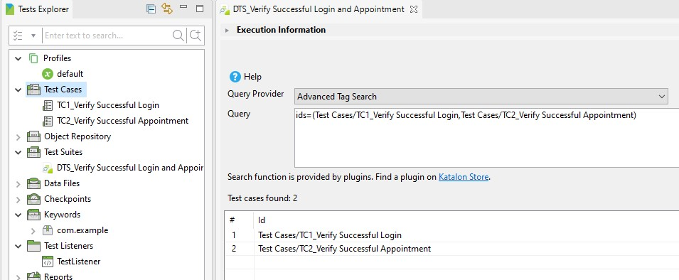
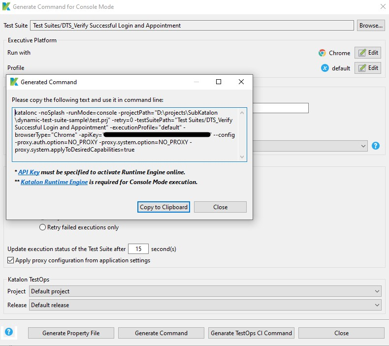
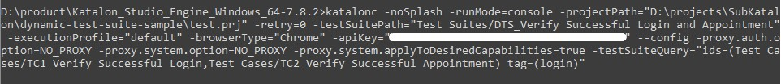

# Basic Search for Dynamic Test Suite sample

## Prerequisites
You need to install one of these plugins depending on your demands:
- [Basic Search For Dynamic Test Suite](https://store.katalon.com/product/2/Basic-Search-For-Dynamic-Test-Suite) (Works on KSE only)
- [Test Case Management with Tags](https://store.katalon.com/product/6/Test-Case-Management-with-Tags) (Works on both KSE and KRE)
## Create several test cases
Create whatever test cases you want (in the [sample project](https://github.com/katalon-studio-samples/dynamic-test-suite-sample), they are TC1_Verify Successful Login and TC2_Verify Successful Appointment)
## Setup the Dynamic Test Suite
- ***Step 1***: Create a new Dynamic test suite, (in the [sample project](https://github.com/katalon-studio-samples/dynamic-test-suite-sample), it was named DTS_Verify Successful Login and Appointment)
- ***Step 2***: Choose ***Query Provider*** as ***Built-in*** or ***Advanced Tag Search***  *(Figure 1)*
- ***Step 3***: Type the Query, below are some syntax:
    - Ids: to search one or more test cases by the exact IDs of test artifacts. The test cases must be separated by a comma *(Figure 1)*.
        > *Ex: ids=(Test Cases/TC1_Verify Successful Login,Test Cases/TC2_Verify Successful Appointment)*

    - Id, name, tag, comment, description (Check this [link](https://docs.katalon.com/katalon-studio/docs/test-suite.html#dynamic-test-suite-dynamic-test-cases-list) for more details)
- ***Step 4***: Click ***Preview*** to check
- ***Step 5***: Click button  

Figure 1: Setup the Dynamic Test Suite

## Setup the execution with query passing from CLI for executing several tests cases
- ***Step 1***: Generate Katalon command for the Dynamic Test Suite *(Figure 2)* > Go to KRE folder > Open Command Line or Terminal > Paste the generated command.
- ***Step 2***: Add into command the parameter -testSuiteQuery *(Figure 3)*.
    > *Ex: -testSuiteQuery="ids=(Test Cases/TC1_Verify Successful Login,Test Cases/TC2_Verify Successful Appointment) tag=(login)"*
    >
    > :information_source: -testSuiteQuery: Allow overriding the search query of Dynamic Test Suite from CLI
- ***Step 3***: Run the command and check the result.

Figure 2: Generate Katalon Command for the Dynamic Test Suite

Figure 3: Run KRE Command

## Preferences
[Basic Search For Dynamic Test Suite](https://store.katalon.com/product/2/Basic-Search-For-Dynamic-Test-Suite)
[Test Case Management with Tags](https://store.katalon.com/product/6/Test-Case-Management-with-Tags)
[Sample project](https://github.com/katalon-studio-samples/dynamic-test-suite-sample)
